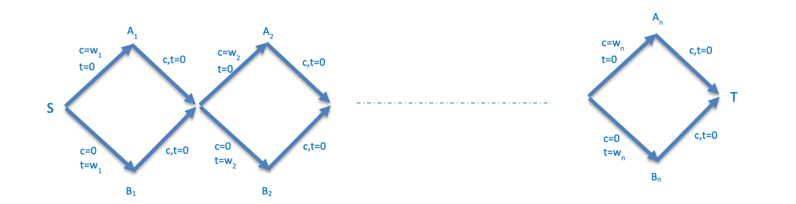

# Let's Prove NP-Complete together

这里我将会展示在 570 课程上接触到的所有证明题目。

Here I will present all the proof problems encountered in course 570.

部分题目我会提供完整证明过程，从证明此问题属于NP，构造，双向证明我都会完整写。部分题目我只提供构造思路，因为证明此类问题最难的其实是构造的方式，其他都是非常简单的。

For some problems, I will provide the complete proof process, including proving that the problem belongs to NP, the construction, and the bidirectional proof. For other problems, I will only provide the construction idea, because the most difficult part of proving these types of problems is the construction method; everything else is quite simple.

- [Let's Prove NP-Complete together](#lets-prove-np-complete-together)
  - [Sushi Express Problem](#sushi-express-problem)
    - [Define the Decision Version](#define-the-decision-version)
    - [Reduction from Set Cover Problem](#reduction-from-set-cover-problem)
    - [Correctness of the Reduction](#correctness-of-the-reduction)
  - [CLIQUE Problem](#clique-problem)
    - [Showing the Problem is in NP](#showing-the-problem-is-in-np)
    - [Reduction from Independent Set Problem](#reduction-from-independent-set-problem)
    - [Correctness of the Reduction](#correctness-of-the-reduction-1)
  - [3-SAT(15/16) Problem](#3-sat1516-problem)
    - [The hint](#the-hint)
    - [Showing the Problem is in NP](#showing-the-problem-is-in-np-1)
    - [Reduction from 3-SAT](#reduction-from-3-sat)
    - [Correctness of the Reduction](#correctness-of-the-reduction-2)
  - [Redundant Clubs Problem](#redundant-clubs-problem)
  - [Zero Weight Cycle Problem](#zero-weight-cycle-problem)
  - [Min-3-SAT Problem](#min-3-sat-problem)
  - [Course Choosing Problem](#course-choosing-problem)
  - [Min-Cost Fast Path Problem](#min-cost-fast-path-problem)

## Sushi Express Problem

The Sushi Express wants to implement a new feature, "order batching." The menu consists of a set of disired food items $F$ and set of combos $c_1, ..., c_n$ where each combo is a set of food items along with a price - we represent combo $c_i = (\{f_i^1, f_i^2, ..., f_i^k\}, p_i)$, where each $f_i^j$ is a food item in the combo. If a student orders $c_i$, they receive each of the food items, and they pay the cost $p_i$. In the new order batching system, the students would input a list of food items that they want, and the order batching system should find the cheapest set of combos, which would include at least one of each desired food item. Write the decision version of this problem, and show via reduction that this decision problem is NP Hard.

Example:

> Foods F = {Fries, Burger, Pizza, drink, sandwich, cookie, chips} \
> C1 = ({Fries, Pizza, cookie}, 10\$) \
> C2 = ({Fries, drink, sandwich}, 15\$) \
> C3 = ({drink, Pizza, chips, burger}, 17$)

### Define the Decision Version

Decision Version 一般就是指的是这样的问题格式：是否存在一个..., 满足k个...存在。

We define the decision version of the Sushi Batching problem as follows:

Input:

- A set of food items $F$
- A collection of combos $C_1, ..., C_n$, where $C_i = (S_i, p_i), S_i \subseteq F$.
- A set of required items $R \subseteq F$
- A budget $B\in\mathbb{Z}^+$.

Question:

Does there exists a subset of combos $I \subseteq \{1, ...,n\}$ such that:

1. $\displaystyle \bigcup_{i\in I} S_i \supseteq R$ (Unite to cover all the food you want), and
2. $\displaystyle \sum_{i\in I} p_i \le B$

**Showing the Problem is in NP**

A certificate can be a subset of combo indices $I \sube \{1,...,n\}$. The certifier checks the following in polynomial time: 

1. Compute $\sum_{i\in I}p_i$ and verify it is $\le B$
2. Compute the union $\bigcup_{i\in I} S_i$ and verify that it contains every element of R.
3. Verify that I has no duplicate indices.

These checks require only scanning sets and summing numbers, all of which take polynomial time. **Thus the problem has an efficient certification and is in NP.**

这一部分都是非常简单的，

### Reduction from Set Cover Problem

We reduce from the classic NP-complete **SET COVER** problem.

A Set Cover problem can be presents as:

- a universe $U = \{e_1,...,e_m\}$
- a family of subsets $S_1,...,S_n \sube U$
- an integer $k$

We construct a Sushi-Batching instance as follows:

1. Let the set of food itmes be $F:= U$
2. For each subset $S_i$, create a combo $C_i = (S_i, p_i)$, and set all prices to $p_i:=1$.
3. Set the required items to be $R:=U$
4. Set the budget to $B:=k$

This construction is clearly polynomial time.

这个构造过程其实是很简单的，基本上就是 Set Cover 套壳而已。

### Correctness of the Reduction

**If the SET COVER instance is YES:**

Suppose there exists a cover $I$ with $|I| \le k$ and $\bigcup_{i\in I} S_i = U$.

Then in our Sushi-Batching instance, selecting the same index set $I$:

- the total price is $\sum_{i\in I} p_i = |I| \le k = B$
- The covered foods are $\bigcup_{i\in I} S_i = U = R$.

Thus the Sushi-Batching instance is also YES.

**If the Sushi-Batching instance is YES:**

Suppose there exists a set of combos I such that:

- $\bigcup_{i\in I} S_i \supseteq R (=U)$
- $\sum_{i\in I} p_i \le B (=k)$

Since each $p_i = 1$, we have $|I| \le k$.

Thus the same I forms a valid set cover of size $\le k$.

Therefore the SET COVER instance is YES.

证明过程永远是需要两个方向的，其实只要知道构造怎么做，其实证明过程就是对应着写，是很简单的。

## CLIQUE Problem

Problem $\operatorname{CLIQUE}(G,k)$ asks whether, given a graph G, does G contain a k-clique? A k-clique is defined to be a set of k vertices such that each pair of these vertices shares an edge. Show via reduction that CLIQUE is NP-complete.

现在其实已经是 decision version 了，所以我们直接开始证明。

### Showing the Problem is in NP

**Certificate:**

A certificate can be a subset of vertices $S \sube V$ with $|S|=k$.

**Certifier:**

Given $(G,k)$ and the certificate $S$, the certifier:

1. Checks that $|S|=k$
2. For every pair $(u,v)$ in $S$, checks whether $(u,v)\in E$

There are at most $k / 2$ pairs, so this verification takes polynomial time in the size of the input graph. Thus CLIQUE has an efficient certifiction and is in NP. 

### Reduction from Independent Set Problem

> [!note]
> 这一题的构造是很经典的，NP完全问题中的经典构造方法：找补图。\
> 这个思想在后面很多题目中，都会有涉及到

Independent Set decision problem:

Input: 

- Graph $G = (V, E)$
- Integer $k$

Question:

Is there a set $S \sube V$ with $|S| \ge k$ such that no two vertices in $S$ share an edge. 

This problem is known to be NP-Complete.

Now, we need to prove that $\operatorname{Independent Set} \le _p \operatorname{CLIQUE}$.

Given an instance $(G = (V, E), k)$ of independent set, we construct an instance $(G = (V, E), k)$ of CLIQUE as follows:

- The vertex set of $G$ is the same: $V(G) := V(G)$.
- The edge set $E$ is the complement of $E$: for every pair of distinct vertices $u,v \in E$, we construct that $(u,v)\in E \to (u,v)\notin E$

That is, we create an edge in G exactly when that edge is not present in G. This construction takes polynomial time (we just check all pair of vertices once). We keep the same parameter $k$.

### Correctness of the Reduction

**direction ->**

Assume $(G,k)$ is a YES-instance of Independent Set. Then there exists $S \sube V$ with $|S| \ge k$ such that no edge in $E$ has both endpoints in S. That means for every pair $u,v \in S$, we have $(u,v) \notin E$. By construction of the complement graph, this implies $(u,v)\in E$ for all $u,v \in S$. Thus every pair of vertices in $S$ is connected by an edge in $G$, so $S$ forms a clique of size at least $k$ in $G$.

Therefore, $(G, E)$ is a YES-instance of CLIQUE.

**direction <-**

Conversely, assume $(G,k)$ is a YES-instance of CLIQUE.

Then there exists set $S \sube V$ with $|S| \ge k$ such that every pair of vertices in $S$ in connected by an edge in E.

By the definition of E, this means that no pair $u,v \in S$ in connected by an edge in $E$.

Hence, $S$ contains no adjacent vertices in the original graph $G$, so $S$ is an independent set of size at least $k$ in $G$. Thus $(G, k)$ is a YES-instance of Independent Set.

## 3-SAT(15/16) Problem

Recall the 3-SAT problem: Given a 3-CNF input formula, it tries to find an assignment of variables that satisfies **ALL** given clauses. Now, we consider a variation — the partial satisfiability problem, denoted as $3\text{-Sat}(\alpha)$, for a specified constant $\alpha$. Here, we are given a collection of $k$ clauses, each of which contains exactly three literals, and we are asked to determine whether there is an assignment of true/false values to the literals such that **at least $\alpha k$ clauses will be true**. Note that for $\alpha = 1$, we have the problem $3\text{-Sat}(1)$ which is exactly the 3-SAT problem as per definition. We want to analyze the problem corresponding to a smaller $\alpha$, in particular, $\alpha = \frac{15}{16},$ which gives us the problem $3\text{-Sat}\left(\frac{15}{16}\right)$.

**Show that the problem $3\text{-Sat}\left(\frac{15}{16}\right)$ is NP-complete.** (20 points)

**Hint:** If $x, y, z$ are variables, there are eight possible clauses containing them:

$(x \lor y \lor z),\ (\lnot x \lor y \lor z),\ (x \lor \lnot y \lor z),\ $

$(x \lor y \lor \lnot z),\ (\lnot x \lor \lnot y \lor z),\ (\lnot x \lor y \lor \lnot z),\ (x \lor \lnot y \lor \lnot z),\ (\lnot x \lor \lnot y \lor \lnot z).$

### The hint

If $x, y, z$ are variables, there are eight possible clauses containing them:

$(x \lor y \lor z),\ (\lnot x \lor y \lor z),\ (x \lor \lnot y \lor z),\ $

$(x \lor y \lor \lnot z),\ (\lnot x \lor \lnot y \lor z),\ (\lnot x \lor y \lor \lnot z),\ (x \lor \lnot y \lor \lnot z),\ (\lnot x \lor \lnot y \lor \lnot z).$

**For any assignment x, y, z, exactly one of these eight clauses will be false, and the other seven will be true.**

### Showing the Problem is in NP

We need to use the efficient certification to prove that $3\text{-Sat}\left(\frac{15}{16}\right)$ is in NP.

In the problem $3\text{-Sat}(\alpha)$:

- **certificate:** a truth assignment to all variables
- certifier:
  1. evaluate each of the $k$ clauses under this assignment
  2. count how many clauses are satisfied
  3. accept iff the number of satisfied clauses is at least $15k/16$

This takes poly-time in the size of the input, so $3\text{-Sat}\left(\frac{15}{16}\right)$ problem has an efficient certification so is in NP.

### Reduction from 3-SAT

now we need to prove that $\text{3-SAT} \le _p \text{3-SAT}(\frac{15}{16})$.

**1. Preprocess: Make the number of clauses a multiple of 8 (for easier use of hints)**

First, let the original problem instance have $k$ clauses $C_1, ..., C_k$. If $k$ is not a multiple of 8, we add some tautological clauses such as $x \or \lnot x\or y$, which are always true, until the total number of clauses becomes $k$, and $k$ is a multiple of 8.

These added clauses do not change satisfiability: the new formula is satisfiable iff the original one is.

**So w.l.o.g. (without loss of generality) assume we start with a 3-SAT formula with $k$ clauses and k is a multiple of 8.**

**2. Construct the new set of clauses**

Now we have $k = 8n$ clauses, we can divide the clauses into $n$ groups, and each group have 8 clauses.  

For each group of 8 clauses, we introduce **three new variables** $x,y,z$ ==(fresh for this block)== and add **8 new clauses** which are exactly the 8 possible clauses over $x,y,z$ listed in the hint.

So each block becomes:

- 8 original clauses, plus
- 8 new clauses over $x,y,z$,

for a total of 16 clauses per block.

Therefore, we have $n$ groups of clauses, each group have 16 (8+8) clauses.

**3. How many clauses can be satisfied at the same time in one block ?**

Obviously, in the 16 clauses, we can at most satisfied 15 clauses at the same time, because for the 8 clauses in the hint: **For any assignment x, y, z, exactly one of these eight clauses will be false, and the other seven will be true.**

Therefore, must be 7 true, 1 false.

If we can satisfied all the clauses in the original 8 clauses, the total number of the satisfaction is 15.

Therefore, we get the 15/16.

### Correctness of the Reduction

The original $\text{3-SAT}$ satisfies ⇔ The new $\text{3-Sat}(\frac{15}{16})$ satisfies at least the clauses of 15/16.

**direction ->**

Assume that the original 3-SAT formula (with k clauses) is satisfied.

Let $\sigma$ be a satisfying assignment of all original variables.

For each block:

- Under $\sigma$, all 8 original clauses are true.
- We can assign values to the new variables $x,y,z$ arbitrarily; for any assignment, exactly 7 of the 8 new clauses are satisfied.

So in each block we can satisfy: 8+7=15 clauses. Therefore, we can satisfied 15/16 clauses overall.

Therefore, the constructed instance of $3\text{-Sat}\!\left(\frac{15}{16}\right)$ is a YES-instance.

**direction <-**

Now suppose the constructed $3\text{-Sat}\!\left(\frac{15}{16}\right)$ instance has an assignment that satisfies at least its 15/16 clauses.

For that to happen, every group (block) must have exactly 15 satisfied clauses.

In any group:

- the 8 new clauses from hint contributes5 at most 7 satisfied clauses
- therefore, to reach 15, all 8 original clauses in that group must be satisfied

So in every group, the original 8 clauses are true under the assignment.

Hence, all k original clauses are satisfied, i.e., the original 3-SAT formula is satisfiable.

Since adding tautologies in the preprocessing step did not change satisfiability, the original input 3-SAT instance is a YES-instance.

这题的构造是比较难的，是一道很有意思的题目。我觉得我自己，如果在考试中遇到这个题目，我是做不出来的了。

## Redundant Clubs Problem

In a certain town, there are many clubs, and every adult belongs to at least one club. Thetown's people would like to simplify their social life by disbanding as many clubs aspossible, but they want to make sure that afterwards everyone will still belong to at least oneclub. Formally, the Redundant Clubs problem has the following input and output. INPUT: List P of people; list C of clubs; lists P; of members of each club i; and number K.OUTPUT: Yes if there exist a set of K clubs such that, after disbanding all clubs in this set, eachperson still belongs to at least one club. No otherwise. Prove that the Redundant Clubs problem \
a. is in NP.(4 pts) \
b. is NP-hard.(16 pts)

**Solution:**

和 Set Cover 问题一样。

set cover 问题是 $S_1...S_m$ 集合覆盖所有点

把 $S_1..S_m$ 看作club，club里面的元素就是顶点，就是人

然后 set cover 问题是，选k个集合，这里就对应选C-K个club

这题是比较简单的。

## Zero Weight Cycle Problem

You are given a directed graph $G=(V,E)$ with weights on its edges $e\in E$. The weights can benegative or positive. The Zero-Weight-Cycle Problem is to decide if there is a simple cycle inG so that the sum of the edge weights on this cycle is exactly 0. Prove that theZero-Weight-Cycle problem \
a) is in NP.(4 pts) \
b) is NP-hard.(16pts)

这题要用 subset-sum 问题去进行规约。

给定整数集合 A = {a₁, a₂, …, aₙ}，问是否存在一个子集 S ⊆ A，使得 ∑(i∈S) aᵢ = 0。

**构造:**

给定 SUBSET-SUM 的输入 a₁,…,aₙ，构造一个有向图 G′=(V′,E′)：

1. 创建 n+1 个节点：v₀, v₁, …, vₙ。
2. 对每个 i=1..n，在 v₍ᵢ₋₁₎ → vᵢ 之间添加两条边：
   - 一条边权为 aᵢ（表示选择 aᵢ）
   - 一条边权为 0（表示不选择 aᵢ）
3. 添加一条边 vₙ → v₀，边权为 0。

任何从 v₀ → v₁ → … → vₙ → v₀ 的简单环，其权值之和等于所走的“选择 aᵢ”边权之和。

**证明:**

若 SUBSET-SUM 有解，即存在子集 S ⊆ A 使得 ∑(i∈S) aᵢ = 0，则在图中从 v₀ 开始，每当 i ∈ S 时走权为 aᵢ 的边，否则走权为 0 的边，最后经过 vₙ → v₀ 的 0 边闭合环。该简单环的总权值为 0，因此 Zero-Weight-Cycle 为 YES。

反之，若图中存在一个简单环，其总权值为 0，则该环必然是 v₀ → v₁ → … → vₙ → v₀ 的路径。在每一步中，环选择的是权为 aᵢ 或权为 0 的边。总权值为 0，表示被选择的 aᵢ 边的权值之和为 0，因此这些被选择的 aᵢ 对应着 SUBSET-SUM 的一个零和解。因此 SUBSET-SUM 为 YES。

由此 $\text{SUBSET-SUM} \le _p\text{Zero-Weight-Cycle}$，问题为 NP-hard。

> [!note]
>
> 和答案有所不同。我是用i-j权重为0表示不选择这条边的，然后答案是用了一条边直接跳过去，其实本质是完全一样的。

## Min-3-SAT Problem

Suppose we have a variation on the 3-SAT problem called Min-3-SAT, where the literals arenever negated. Of course, in this case it is possible to satisfy all clauses by simply setting allliterals to true. But, we are additionally given a number k, and are asked to determine if wecan satisfy all clauses while setting at most k literals to be true. Prove that Min-3-SAT \
a) is in NP.(4 pts) \
b) is NP-hard.(16 pts)

这题其实也是很简单的：

**每个顶点 → 一个变量**

**关键构造：每条边 (u,v) → 子句 (u ∨ u ∨ v)**

如果你选择 ≤k 个 TRUE 的变量满足所有子句⇔你选择 ≤k 个顶点 cover 所有边。

## Course Choosing Problem

There are n courses at USC, each of them requires multiple disjoint time intervals. For example, a course may require the time from 9am to 11am and 2pm to3pm and 4pm to 5pm (you can assume the number of intervals of a course is at least 1, at most n). You cannot choose any two overlapping courses. You want to know, given a number K, if it's possible totake at least K courses. Prove that the Course Choosing problem \
a) is in NP.(4 pts) \
b) is NP-hard.(16 pts)

每门课 ->顶点

如果两门课有冲突 -> 连起来，构造一条边

求IS问题

## Min-Cost Fast Path Problem

In the Min-Cost Fast Path problem, we are given a directed graph G=(V,E) along with positiveinteger times t and positive costs c on each edge. The goal is to determine if there is a path Pfrom s to t such that the total time on the path is at most Tand the total cost is at most C (both Tand Care parameters to the problem). Prove that this problem is NP-complete.

subset-sum = 决定每个数字“选 or 不选”。

我们让从 s 到 t 的路径依次经过 n 个 gadget，每个 gadget 有两条路，分别代表“选 wᵢ”和“不选 wᵢ”。

走 A 路给 time += wᵢ（表示选它），走 B 路给 cost += wᵢ（表示不选它）。

整条 s→t 路的 time 就是 subset 的和，cost 就是未选数字的和。

用 T 和 C 限制 time 和 cost，就完全等价于 subset-sum 的条件。

> [!important]
> 以后遇到选和不选的问题，都要联想到这个subsetsum！