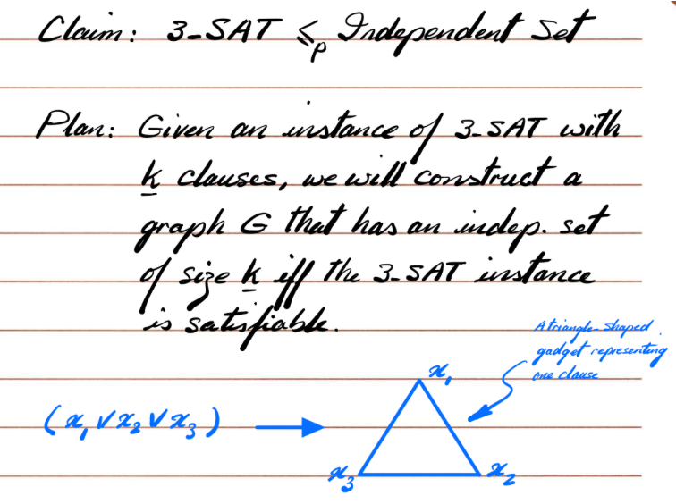
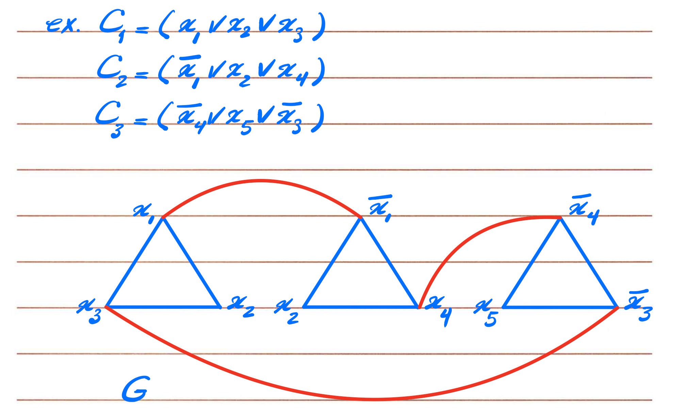
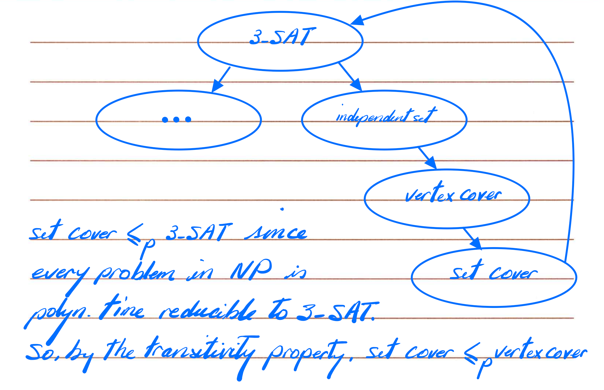

# Polynomial-Time Reductions and the Foundations of NP-Completeness

[中文](./reductions_cn.md) | [English](./reductions.md)

- [Polynomial-Time Reductions and the Foundations of NP-Completeness](#polynomial-time-reductions-and-the-foundations-of-np-completeness)
  - [Polynomial-Time Reduction](#polynomial-time-reduction)
  - [Independent Set vs. Vertex Cover: The Classic Mutual Reduction](#independent-set-vs-vertex-cover-the-classic-mutual-reduction)
    - [Independent Set Problem and Vertex Cover Set Problem](#independent-set-problem-and-vertex-cover-set-problem)
    - [Important FACT](#important-fact)
    - [Mutual Reduction](#mutual-reduction)
  - [Set Cover: A More General Form of Vertex Cover](#set-cover-a-more-general-form-of-vertex-cover)
  - [Reduction Using Gadgets (From SAT to Graph)](#reduction-using-gadgets-from-sat-to-graph)
    - [Clause and Literal](#clause-and-literal)
    - [SAT and 3-SAT](#sat-and-3-sat)
    - [Reduction: 3-SAT \<= p Independent Set](#reduction-3-sat--p-independent-set)
    - [Prove the correctness of the reduction in two directions](#prove-the-correctness-of-the-reduction-in-two-directions)
  - [NP-hard and NP-complete](#np-hard-and-np-complete)
    - [NP-hard definition (at least this difficult)](#np-hard-definition-at-least-this-difficult)
    - [NP-complete Definition](#np-complete-definition)
  - [Transitivity of Reduction](#transitivity-of-reduction)
  - [How to prove that a problem X is NP-complete?](#how-to-prove-that-a-problem-x-is-np-complete)
  - [Collection of Proof Examples](#collection-of-proof-examples)

## Polynomial-Time Reduction

In complexity theory, "reduction" is the most important tool for studying the difficulty of a problem.

First, let's clarify what reduction means.

We often say:

> If problem X is at least as hard as problem Y, it means that if we can solve X, we can incidentally solve Y.

This is easy to understand.

Formally, it's defined as polynomial reduction:

> $Y \le _p X$ \

Y can be solved using a polynomial-time algorithm, plus a black box that calls X several times.

**Intuitive Understanding:**

- We want to solve Y

- But we can't

- So we transform Y into X

- As long as there's a black box that can solve X, we can solve Y.

Reduction helps us compare the difficulty of problems.

Understanding Method:

- If everyone can replace Y with X in polynomial time

- Then X is at least no simpler than Y

## Independent Set vs. Vertex Cover: The Classic Mutual Reduction

To intuitively understand reduction, we'll start with two simple and closely related problems.

### Independent Set Problem and Vertex Cover Set Problem

The descriptions of these two problems have been covered in the previous two chapters and will not be repeated here.

### Important FACT

Very Important:

In a graph $G = (V, E)$: $S$ is an independent set ⇔ $V − S$ is a vertex cover

**Intuition:**

- If no two vertices in S are adjacent

- Then every edge has at least one endpoint outside $S$

- Therefore, the complement $V−S$ must cover all edges

and vice versa.

This complement relationship naturally leads to reduction.

### Mutual Reduction

$\text{Independent Set} \le _p \text{Vertex Cover}$

**Question: Does G have an independent set ≥ k?**

Transformed into:

**Question: Does G have a vertex cover ≤ n − k?**

Reason:

- S is an independent set

- V−S is a vertex cover

- |V−S| = n − |S|

- Therefore, |S| ≥ k ⇔ |V−S| ≤ n−k

Therefore, we only need to ask the black box:

“Does the vertex cover size ≤ n−k?”

If the black box answers YES, then the Independent Set answer is also YES.

***
$\text{Vertex Cover} \le _p \text{Independent Set}$

Similarly:

Judging “VC ≤ k” is equivalent to judging “IS ≥ n−k”.

**These two reductions are known conclusions and can be used directly.** **
## Set Cover: A More General Form of Vertex Cover

Definition of Set Cover:

Given a set of elements $U$ and several "subsets" $S_1, ..., S_m$, is it possible to choose $\le k$ sets to cover all elements?

Vertex Cover can be reduced to Set Cover:

- Elements = Edges of the graph

- Each vertex v corresponds to a set S(v) containing all edges connected to v

- Choosing a vertex to cover edges ⇔ Choosing sets to cover elements

Therefore:

$\text{Vertex Cover} \le _p \text{Set Cover}$

So Set Cover is at least as difficult as Vertex Cover.

## Reduction Using Gadgets (From SAT to Graph)

Next, we move on to "gadget construction" in complexity theory.

A gadget is a small structure used to simulate logical relationships.

This section aims to:

- Introduce clause, literal, and assignment

- Then, using a gadget, reduce 3-SAT to an Independent Set

This part is the core technique for NP-completeness.

### Clause and Literal

- Clause = Several literals connected by OR

- Literal = Variable x or its negation ¬x

This concept was actually discussed earlier when the SAT problem was mentioned.

$x_1 \vee ¬x_3 \vee x_4$

When does an assignment satisfy a clause? The clause is satisfied as long as at least one literal is true.

### SAT and 3-SAT

SAT Problem:

Does an assignment to a variable make all clauses true?

For example, given several clauses: $C_1, C_2, ..., C_k$

We need to find an assignment to a variable that makes all clauses true.

**3-SAT is a special case: each clause has exactly 3 literals.**

### Reduction: 3-SAT <= p Independent Set

**This is one of the most classic reductions in NP-complete theory.** **

**(1) Create a triangle gadget for each clause**

For example, clause: $x \vee y \vee ¬z$

The triangle guarantees:

- You cannot select two literals in the same clause at the same time

- Each clause can take at most 1 point as a member of IS

**This means:**

"At least one point in a clause is true"

**(2) Prohibit x and ¬x from being selected at the same time (add conflict edges)**

If literal a means "x = true", literal b means "x = false"

→ You cannot select both into the independent set

→ Connect them with an edge

### Prove the correctness of the reduction in two directions

A. If 3-SAT satisfies → There exists an independent set of size = number of clauses

Select one true for each clause Literal:

- Choose one from each triangle

- No conflict (x and ¬x cannot both be true)

- Therefore, an independent set is formed

B. If there exists an independent set of size = number of clauses → a satisfying assignment can be constructed

Because:

- Only one can be chosen from each triangle

- A total of k triangles were chosen (k = number of clauses)

→ Each clause chooses one literal

→ Assigning the chosen literal to true → a satisfying assignment is obtained

## NP-hard and NP-complete

### NP-hard definition (at least this difficult)

A problem X is NP-hard if:

All problems Y in NP can be reduced to X ($Y \le _p X$).

**NP-hard does not require:**

- X is in NP

- X is verifiable

- X is decisionable

Example: Halting Problem

### NP-complete Definition

**(Important Definition)** A problem X is NP-complete if and only if:

1. X ∈ NP (verifiable)

2. For all Y ∈ NP, Y ≤ ₚ X (hardest)

**Properties:**

- NP-complete is the "hardest core" of NP

- If an NP-complete problem can be solved polytime,

then all NP problems can be solved polytime,

and P = NP

## Transitivity of Reduction

Very crucial:

If Z ≤ ₚ Y and Y ≤ ₚ X, then Z ≤ ₚ X.

Therefore:

- It is not necessary to start the reduction from "all NP problems"

- It is only necessary to reduce from a problem that is already NP-complete

**SAT is the first problem to be proven NP-complete (Cook-Levin theorem),

therefore SAT becomes the "starting point" for all NP-complete proofs.**

## How to prove that a problem X is NP-complete?

**The classic three-step method:**

**Step 1:** Prove X ∈ NP

Give a certificate and certifier.

**Step 2:** Choose a known NP-complete problem Y

For example:

- 3-SAT

- Independent Set

- Vertex Cover

- Hamiltonian Cycle

**Step 3:** Prove Y ≤ ₚ X

That is:

Encode instance Y into instance X

and prove the correctness in both directions (YES→YES, NO→NO)

After completing the above three steps → X is NP-complete.

## Collection of Proof Examples

This section compiles a series of proof problems, including commonly used construction methods.

- [prove_np_complete.md](./prove_np_complete.md)